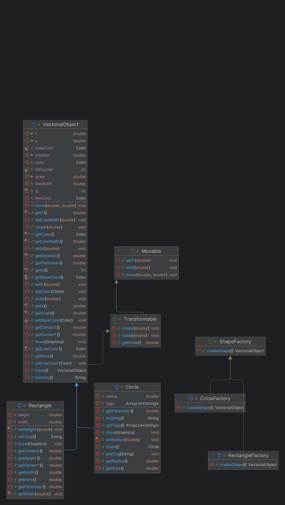

# Vektorinės grafiko redaktorius

**Autorius:** Augustinas Bičkaitis 

**Data:** 2025 m. gegužės 26 d.

## Paskirtis

Ši programa yra vektorinės grafikos redaktorius, leidžiantis vartotojui kurti, valdyti ir saugoti vektorinius objektus. Programa sukurta naudojant objektinio programavimo principus ir projektavimo šablonus, siekiant gilinti objektinio programavimo žinias ir gebėjimus.

## Paleidimas

Programa paleidžiama vykdant `EditorFrame` klasę, kuri inicijuoja vartotojo sąsajos užkrovimą. Norint paleisti programą, reikia:

1. Įsitikinti, kad visi projekto failai yra teisingai sukonfigūruoti
2. Paleisti `src.view.EditorFrame` klasę
3. Programa automatiškai atvers redaktoriaus langą

## Funkcionalumas

Programa šiuo metu palaiko šias funkcijas:

- **Vektorinių figūrų kūrimas** - galima pridėti dvi pagrindines figūras – stačiakampį (Rectangle) ir apskritimą (Circle)
- **Figūrų spalvos pasirinkimas** - galima pasirinkti figūros užpildo ir apvedimo linijos spalvas
- **Figūrų perkėlimas/modifikavimas** - piešiant figūrą galima pasirinkti jos dydį, o vėliau ant jos paspaudus ją perkelti
- **Lentos išvalymas** - vartotojas gali išvalyti lentą panaikindamas visas figūras
- **Redaktoriaus išsaugojimas** - leidžia išsaugoti esamą redaktoriaus būseną (visus objektus)
- **Automatinis atkūrimas** - paleidus programa yra atkuriama paskutinė išsaugota būsena
- **Greitieji klavišai** - paspaudus 'c' pasirenkamas apskritimas, 'r' - stačiakampis, 's' - figūrų perkėlimo režimas

## Pagrindinės klasės

Programą sudaro šios pagrindinės klasės:

### Shapes paketas:
- `VectorialObject` - abstrakti bazinė klasė
- `Rectangle` - konkreti stačiakampio klasė
- `Circle` - konkreti apskritimo klasė

### Interfaces paketas:
- `Movable` - apibrėžia figūros pozicijos keitimo galimybę
- `Tansformable` - apibrėžia figūros dydžio keitimo galimybę

### Factory paketas:
- `ShapeFactory` - abstrakti gamyklos klasė figūrų sukūrimui
- `RectangleFactory` - sukuria stačiakampį (Rectangle)
- `CircleFactory` - sukuria apskritimą (Circle)

### view paketas:
- `EditorFrame` - pagrindinė redaktoriaus klasė
- `EditorPanel` - redaktoriaus lapo laukas
- `SidebarPanel` - spalvų mygtukai ir 

### Data paketas:
- `LoadState` - redaktoriaus atkūrimas
- `SaveState` - redaktoriaus išsaugojimas

### Exceptions paketas:
- `EditorException` - apibendrinta redaktoriaus klaida
- `BadRadiusValue` - klaidingo spindulio klaida

## Klasių diagrama

## Projektavimo šablonai

Programoje panaudoti šie projektavimo šablonai (design patterns):

1. **Factory Method** - naudojamas `ShapeFactory`, `RectangleFactory` ir `CircleFactory` klasėse redaktorių objektų sukūrimui. Šis šablonas leidžia kurti skirtingų tipų figūras per bendrą sąsają.

2. **Template Method** - naudojamas `VectorialObject` abstrakčioje klasėje, kur bendras elgesys apibūdintas pagrindinėje klasėje, o specifiniai metodai (pvz., `scale()`) įgyvendinami paveldėtose klasėse.

## Plėtimo galimybės

Programą galima plėsti šiomis kryptimis:

- Pridėti daugiau geometrinių figūrų: trikampiai, linijos, daugiakampiai.
- Įgyvendinti sluoksnių (angl. layers) sistemą.
- Įtraukti atšaukimo/pakartojimo (undo/redo) funkcionalumą.
- Pridėti įrankį tekstui piešinyje įterpti.
- Kelių langų atidarymas vienu metu.

## Išvados

Sukurta vektorinės grafikos redagavimo sistema demonstruoja aiškią architektūrą, pagrįstą OOP principais ir projektavimo šablonais. Modulinė struktūra leidžia lengvai papildyti naujomis figūromis ar funkcionalumu, išlaikant kodo tvarką ir skaitomumą.